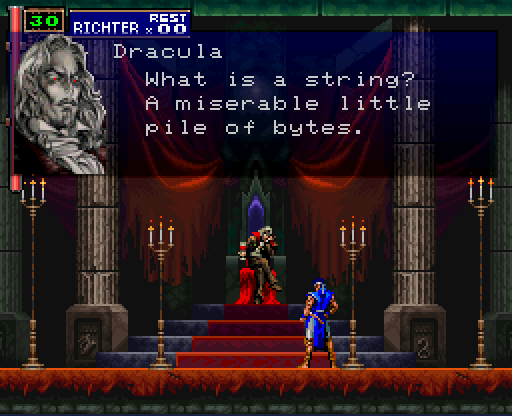

+++
title = "Writing UTF-8 Programs in Plan 9"
date = "2022-02-25"
tags = [
	"plan9",
	"utf8",
]
+++

# Writing UTF-8 Programs in Plan 9

This post was written using 9front/amd64 “COMMUNITY VS INFRASTRUCTURE” as a reference.

Programs are built on Plan 9 using the [2c(1)](http://man.cat-v.org/9front/1/2c) compiler suite. 

Thus, on amd64:

```text
tenshi% 6c rsize.c
tenshi% 6l rsize.6
tenshi% 6.out
わ 4 4
tenshi% 
```

Remember, in C, a `char` (ASCII character) is [almost always](https://news.ycombinator.com/item?id=12903031) 1 byte (8 bits). 

This document presumes that a non-rune char is 1 byte. 

## Initial reading

- [C Programming in Plan 9](http://doc.cat-v.org/plan_9/programming/c_programming_in_plan_9)

## UTF-8 in Plan 9

Plan 9 is full of UTF-8 aware programs, which makes sense, given that [Plan 9 was the system UTF-8 was designed on/for](http://doc.cat-v.org/bell_labs/utf-8_history).

[Wc(1)](http://man.cat-v.org/9front/1/wc) has a rune flag (very useful): 

```text
tenshi% wc -c -r < /lib/hiragana
    447     737
tenshi% 
```

[Tr(1)](http://man.cat-v.org/9front/1/tr) works on runes:

```text
tenshi% echo 'αβψ' | tr -d 'β'
αψ
tenshi% 
```

The [compiler suite](http://man.cat-v.org/9front/1/2c) permits UTF-8 characters in source code, as seen in `☺☻☹.c` below:

```c
#include <u.h>
#include <libc.h>
typedef int ☺☹☻;
typedef void ☹☺☻;
enum
{
	☹☻☺ = sizeof(☺☹☻),
	☻☺☹ = 0,
};

☹☺☻
main(☹☺☻)
{
	☺☹☻ ☺☻☹;

	for(☺☻☹=☻☺☹; ☺☻☹<☹☻☺; ☺☻☹++)
		print("☺☻☹ = %d\n", ☺☻☹);
		exits(☻☺☹);
}
```
→
```text
tenshi% 6.out
☺☻☹ = 0
☺☻☹ = 1
☺☻☹ = 2
☺☻☹ = 3
tenshi% 
```

Plan 9 happens to be the source of a, if not the only, unicode-aware troff implementation. 

The list goes on.

## Runes



What is a rune?

On Plan 9 it's:

```text
tenshi% grep Rune /$objtype/include/u.h
typedef	uint		Rune;
tenshi% 
```

A `uint` of course being:

```text
tenshi% grep uint /$objtype/include/u.h
typedef unsigned int	uint;
```

Okay, but how big is that _actually_?

A quick program to be sure:

```c
#include <u.h>
#include <libc.h>

void
main(int, char*[])
{
	Rune r = L'わ';
	print("%C %d %d\n", r, sizeof r, sizeof (Rune));
	exits(nil);
}
```

Yielding:

```text
tenshi% 6.out
わ 4 4
tenshi% 
```

So a rune is 32 bits. 

What's stored in a rune? 

The [utf(6)](http://man.cat-v.org/9front/6/utf) manual says it best:

```text
In Plan 9, a rune is a 32-bit quantity representing a Uni-
code character.  Internally, programs may store characters
as runes.  However, any external manifestation of textual
information, in files or at the interface between programs,
uses a machine-independent, byte-stream encoding called UTF.

UTF is designed so the 7-bit ASCII set (values hexadecimal
00 to 7F), appear only as themselves in the encoding.  Runes
with values above 7F appear as sequences of two or more
bytes with values only from 80 to FF.
```

So a rune is truly 32 bits. 

## Runes in C

As seen in ['C Programming in Plan 9'](http://doc.cat-v.org/plan_9/programming/c_programming_in_plan_9), Plan 9 introduces a few pleasantries to make writing rune-friendly programs a bit easier. 

From the same document:

```c
#include <u.h>
#include <libc.h>

void
main()
{
    print("3 %C 4\n", L'≤');
    print("%S\n", L"Άρχιμήδης"); /* Archimedes */
}
```

Yielding:

```text
tenshi% 6.out
3 ≤ 4
Άρχιμήδης
tenshi% 
```

There are a few patterns that can save you from overthinking the rune↔char conversion. 

In most cases in C, if you get input from somewhere, the input is in bytes, or, a `char[]`. 

A `char[]` is not a an array of runes, however, but just bytes. Runes can span multiple bytes and ostensibly go all the way up to 4-bytes wide. 

So operating on individual written characters (runes) is not necessarily as simple as iterating through the bytes. 

Thankfully, getting from a `char[]` to a `Rune[]` is fairly straightforward. 

`smprint(2)` and `runesmprint(2)` (or other `print(2)` functions as appropriate) permit the emission of a `malloc(2)`'d buffer of bytes and runes, respectively. 

So, in practice, we can convert an entire string into a new buffer:

```c
#include <u.h>
#include <libc.h>

void
main(int, char*[])
{
	Rune	*rstr = L"☺☹☻",	*rout;
	char	*bstr = "abc123",	*bout;

	rout = runesmprint("%s", bstr);
	bout = smprint("%S", rstr);
	print("%S (%d)\n%s (%d)\n", rstr, runestrlen(rstr), bout, strlen(bout));
	print("%s (%d)\n%S (%d)\n", bstr, strlen(bstr), rout, runestrlen(rout));

	free(rout);
	free(bout);
	exits(nil);
}
```
→
```text
tenshi% 6.out
☺☹☻ (3)
☺☹☻ (9)
abc123 (6)
abc123 (6)
tenshi% 
```

Iterating through characters in a `Rune[]` lets us work with individual, legible, unicode, characters as we would bytes in traditional C. 

## Case Study: K&R exercise 1-19

'The C Programming Language' has exercises in it for completion by the reader. Exercise 1-19 asks the reader to implement a program that reverses individual lines of its input using a function `reverse(s)`. 

The prompt is almost certainly written with only ASCII characters as input, so reversal is, in theory, trivial. In the spirit of reimplementing K&R exercises in Plan 9 C, I decided to pursue UTF-8 compliance. 

In-place array reversal in C [is more or less well understood](https://stackoverflow.com/questions/22977859/reversing-an-array-in-place), but what we'll be given as our input is probably going to be plain bytes.

My solution used the [`bio(2)`](http://man.cat-v.org/9front/2/bio) library, specifically `Brdstr(2)` for reading input, so each read returns a `malloc(2)`'d `char*` containing the line of bytes until the next `\n`, with the `\n` replaced by a `\0` null delimiter. 

Since we're not working with just bytes and thus the atomic unit in our reversal is potentially multiple bytes, we should implement it as working on `Rune*`. 

Here's a trimmed down version of the program:

```c
#include <u.h>
#include <libc.h>
#include <bio.h>

Rune*
reverse(Rune *in, Rune *out, usize len)
{
	int i;
	int to = 0, from = len-1;
	while(from >= 0){
		out[to] = in[from];
		from--;
		to++;
	}

	return out;
}

void
main(int, char*[])
{
	Biobuf	*in, *out;
	in = Bfdopen(0, OREAD);
	out = Bfdopen(1, OWRITE);

	while(1){
		long rlen = 0;
		char *line;
		int len = 0, n, i;
		Rune *rev, *rstr;

		line = Brdstr(in, '\n', 1);
		len = Blinelen(in);
		if(line == 0)
			break;

		rstr = runesmprint("%s", line);
		rlen = runestrlen(rstr);
		rev = calloc(rlen+1, sizeof (Rune));
		reverse(rstr, rev, rlen);
		rev[rlen] = '\0';

		n = Bprint(out, "%S\n", rev);

		free(line);
		free(rev);
		free(rstr);
	}

	Bterm(in);
	Bterm(out);

	exits(nil);
}
```

Here's an example of the program running on [`/lib/hiragana`](http://git.9front.org/plan9front/plan9front/840d16912a39d1207a2ceb82755f690e15f17e4b/lib/hiragana/f.html):

```text
term% 8.out < /lib/hiragana
anagariH


-	k	s	t	n	h	m	y	r	w

a  あ	か	さ	た	な	は	ま	や	ら	わ
i  い	き	ihsし	ihcち	に	ひ	み		り	ゐ
u  う	く	す	ustつ	ぬ	ufふ	む	ゆ	る	
e  え	け	せ	て	ね	へ	め		れ	ゑ
o  お	こ	そ	と	の	ほ	も	よ	ろ	oを

m/nん
g	z	d		b	p			

a	が	ざ	だ		ば	ぱ			
i	ぎ	ijじ	ijぢ		び	ぴ			
u	ぐ	ず	uzづ		ぶ	ぷ			
e	げ	ぜ	で		べ	ぺ			
o	ご	ぞ	ど		ぼ	ぽ			


yk	hs	hc	yn	yh	ym		yr	

a	ゃき	ゃし	ゃち	ゃに	ゃひ	ゃみ		ゃり	
u	ゅき	ゅし	ゅち	ゅに	ゅひ	ゅみ		ゅり	
o	ょき	ょし	ょち	ょに	ょひ	ょみ		ょり	


yg	j	j		yb	yp			

a	ゃぎ	ゃじ	ゃぢ		ゃび	ゃぴ			
u	ゅぎ	ゅじ	ゅぢ		ゅび	ゅぴ			
o	ょぎ	ょじ	ょぢ		ょび	ょぴ			
term% 
```

The above program is much more complex (and less time/memory efficient) than its byte-oriented counterpart. Rather, the program actually works with languages other than English, which is most languages. 

The complete K&R 1-19 solution source: https://shithub.us/henesy/kandr/HEAD/ex/ex1-19.c/f.html ☦

## An aside on whitespace

Does multi-byte (UTF-8-only) whitespace exist? Go doesn't think so:

```go
package main

import (
	"fmt"
)

func main() {
	fmt.Println("Max:", ^byte(0))
	// From Go's "unicode" package's `unicode.IsSpace()`
	// https://github.com/golang/go/blob/go1.17.7/src/unicode/graphic.go#L126
	for _, r := range []int{'\t', '\n', '\v', '\f', '\r', ' ', 0x85, 0xA0} {
		fmt.Println(r)
	}
}
```
⇒
```text
Max: 255
9
10
11
12
13
32
133
160
```

All values fit under the 1-byte max of ≤255. 

## Functions to know

In the interest of making it easier to find what you want when writing your UTF-8-friendly programs, a few manuals:

Rune and UTF-8 conversion → [rune(2)](http://man.cat-v.org/9front/2/rune).

String utilities, but implemented against `Rune*` → [runestrcat(2)](http://man.cat-v.org/9front/2/runestrcat). 

Unicode character (rune) functions, such as `tolower()` → [isalpharune(2)](http://man.cat-v.org/9front/2/isalpharune). 

While mostly dealing with bytes, [bio(2)](http://man.cat-v.org/9front/2/bio) includes some `Rune`-specific functions:

```text
long  Bgetrune(Biobufhdr *bp)
int   Bungetrune(Biobufhdr *bp)
int   Bputrune(Biobufhdr *bp, long c)
```

Bio's `Bprint()` also respects `%S` and `%C`, of course. 

## References

- [rune(2)](http://man.cat-v.org/9front/2/rune)
- [runestrcat(2)](http://man.cat-v.org/9front/2/runestrcat)
- [isalpharune(2)](http://man.cat-v.org/9front/2/isalpharune)
- [utf(6)](http://man.cat-v.org/9front/6/utf)
- [`/lib/unicode`](http://git.9front.org/plan9front/plan9front/840d16912a39d1207a2ceb82755f690e15f17e4b/lib/unicode/f.html)
- [The Plan 9 C Compilers](http://doc.cat-v.org/plan_9/4th_edition/papers/compiler)
- [The history of UTF-8 as told by Rob Pike](http://doc.cat-v.org/bell_labs/utf-8_history)
- [C Programming in Plan 9](http://doc.cat-v.org/plan_9/programming/c_programming_in_plan_9)
- [The Absolute Minimum Every Software Developer Absolutely, Positively Must Know About Unicode and Character Sets (No Excuses!)](https://www.joelonsoftware.com/2003/10/08/the-absolute-minimum-every-software-developer-absolutely-positively-must-know-about-unicode-and-character-sets-no-excuses/)
- [Strings, bytes, runes and characters in Go](https://go.dev/blog/strings)

☦ If you want to see me struggle with this particular exercise, it's on video: <https://youtu.be/kWeeQnO0DNc?t=1022>
