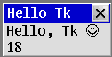
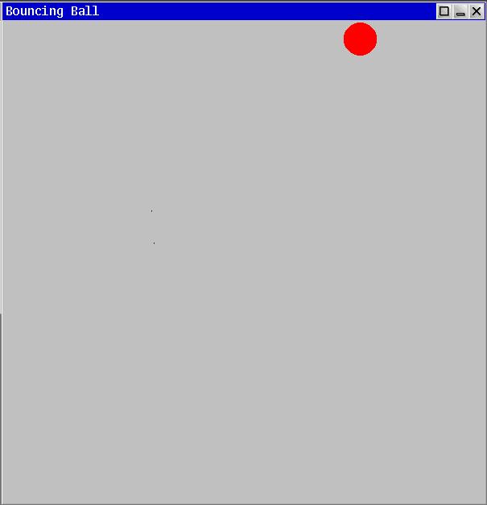

+++
title = "Limbo GUI's with Tk"
date = "2020-11-20"
tags = [
	"inferno",
	"limbo",
]
+++

# Limbo GUI's with Tk

## Motivation

GUI programming can be very difficult and documentation for writing graphical programs can be provided with a large number of assumption on pre-existing knowledge, etc.

Additionally, compartmentalized examples which do not employ some kind of *`other tricks'* can be hard to come by. This problem is exasperated for less well-known systems such as Inferno.

The first version of the second program shown below was written over a year ago, but did not work well and presented only the most minimal fulfillment of what could be called a functioning graphical program.

Now, after some research and careful study of the graphical libraries, some manual inaccuracies and a lack of examples ended with a working and responsive demonstration of how to write a complete, high-level, graphical program under Inferno.

## Introduction

This post assumes you're using Inferno, specifically [purgatorio](https://code.9front.org/hg/purgatorio/), hosted under `linux/amd64` or similar.

It's also possible to use Inferno under Docker as per the `INSTALL` file.

For an in-depth introduction to setting up and performing software development-related operations under Inferno, see [Program development in Limbo](/limbo-intro/).

Two libraries for writing GUI programs will be demonstrated, [tkclient(2)](http://man.postnix.pw/purgatorio/2/tkclient) and [wmclient(2)](http://man.postnix.pw/purgatorio/2/wmclient).

Neither of the two example programs contain particularly complex operations and neither have a great deal of control flow complexity to make the basic graphical operations more intuitive.

## Hello tkclient(2)

Tk is called by invoking a handful of library routines and writing string commands.

Tkclient allows one to avoid some common command invokations and defer to a handful of procedures to simplify development.

The following program, HelloTk, shows a fixed message on the first line and prints the current 'tick' count on the second line.

HelloTk's window can be moved, closed, and left to the background with no graphical issues.

With Tkclient, Tk commands must be invoked explicitly for some operations as seen with the `tk->cmd()` function.

The basic structure of the program is to initialize Tk's state and window details, spawn the timer/period ticker process, and alternate on a set of event channels until the program is closed. Note that the first step before first invoking a Tk routine is start a new process group, this action will compartmentalize child processed created through `spawn` later and permit more straightforward cleanup of the program come time to exit.

The `kbd` channel receives keyboard inputs, `ptr` receives mouse inputs, and the `ctl`, `wreq`, and `wmctl` channels receive window manager/Tk events.

Every second, the `tick` channel will be filled, the `n` count of ticks will go up, and the text inside the window will be updated to reflect the new value.

The final source: https://github.com/henesy/limbo-playground/blob/master/hellotk/

**[hellotk.b](./hellotk.b)**
```c
implement HelloTk;

include "sys.m";
	sys: Sys;

include "draw.m";
	draw: Draw;

include "tk.m";
	tk: Tk;

include	"tkclient.m";
	tkclient: Tkclient;

HelloTk: module {
	init:	fn(ctxt: ref Draw->Context, argv: list of string);
};


init(ctxt: ref Draw->Context, nil: list of string) {
	sys  = load Sys  Sys->PATH;
	if (ctxt == nil)
		raise "no window context";

	draw = load Draw Draw->PATH;
	tk   = load Tk   Tk->PATH;
	tkclient= load Tkclient Tkclient->PATH;

	# Make a new process group for us and child processes
	sys->pctl(Sys->NEWPGRP, nil);

	# Start Tk
	tkclient->init();

	# Create window
	(t, wmctl) := tkclient->toplevel(ctxt, "", "Hello Tk", 0);

	# Set the text to be displayed
	text := "Hello, Tk ☺ \n";
	tk->cmd(t, "label .d -label {" + text + "}");

	# Build the window
	height := 1;		# 2 lines
	tk->cmd(t, "pack .d; pack propagate . " + string height);
	tkclient->onscreen(t, nil);

	# Start receiving keyboard and mouse input
	tkclient->startinput(t, "kbd"::"ptr"::nil);

	# Set a ticker to trigger periodic re-draw'ing
	tick := chan of int;
	spawn timer(tick);

	n := 0;
	for(;;)
		alt {
		key := <-t.ctxt.kbd =>
			# Ticks every keyboard button press
			sys->print("key = %d\n", key);
			tk->keyboard(t, key);

		ptr := <-t.ctxt.ptr =>
			# Ticks every time the pointer moves/clicks
			tk->pointer(t, *ptr);

		s := <-t.ctxt.ctl
		or	s = <-t.wreq
		or	s = <-wmctl =>
			# Ticks every time the window itself has an event
			sys->print("tk string = \"%s\"\n", s);
			tkclient->wmctl(t, s);

		<-tick =>
			# Update the text on screen
			str := text + string ++n;
			tk->cmd(t, ".d configure -label {" + str + "};update");
		}
}

timer(c: chan of int) {
	for(;;) {
		c <-= 1;
		sys->sleep(1000);
	}
}
```

The program appears as:



## Hello wmclient(2)

Tk doesn't always have to be interacted with directly.

A more terse interface can be used for building graphical programs, enter [wmclient(2)](http://man.postnix.pw/purgatorio/2/wmclient).

Wmclient is designed to allow building a user interface on top of the graphical environment provided by [wm(1)](http://man.postnix.pw/purgatorio/1/wm).

Proportionally, Wmclient is less used than Tkclient throughout Inferno, with only a handful of programs using Wmclient:

```text
/appl/acme
/appl/cmd/9win.b
/appl/cmd/touchcal.b
/appl/wm/clock.b
/appl/wm/drawmux
/appl/wm/wm.b
```

Pleasantly, as shown in the bouncing ball demonstration (`bb`) below, we get all the window decorations and a program responsive to being minimized, resized, etc.

Programs written with Wmclient aren't necessarily tied to being run under `wm/wm` either. The bouncing ball program can be started as the first graphical application and a [draw-context(2)](http://man.postnix.pw/purgatorio/2/draw-context) is allocated as-needed.

The bouncing ball demonstration allocates a ball image, a background image, and a background image for the ball which is used to minimize visible tearing and a trail behind the ball as the ball moves.

That is, `ballbg` will be drawn around the ball - `+2` pixels each direction - and match the color of the background.

The flow of `bb` is similar to the HelloTk program above. Several input channels are alternated upon with the values arriving being passed on to their respective library handlers.

The `tickchan` channel will receive a signal every `delay` milliseconds, triggering a movement and re-draw of the ball. Thus, every 10ms, the ball and its background moves and is re-rendered inside the window. Note that the background for the window is not re-drawn on a tick.

Every time a window manager event occurs down the `w.ctl` or `w.ctxt.ctl` channels, the background is re-drawn and the ball is re-placed at the center of the window.

The `w.imager()` method for a `wmclient->Window` type will return the rectangle of the window which is drawable inside and does not include the window decorations, etc. This allows for avoidance of approximating the *functional* size of a window for drawing routines.

The final source: <https://github.com/henesy/bouncingball-limbo>

**[bb.b](./bb.b)**
```c
implement BouncingBall;

include "sys.m";
	sys: Sys;

include "draw.m";
	draw: Draw;
	Point, Rect, Display, Image, Screen, Context: import draw;

include "tk.m";
	tk: Tk;
include "wmclient.m";
	wmclient: Wmclient;
	Window: import wmclient;

include "daytime.m";
include "rand.m";
	rand: Rand;

include "arg.m";


BouncingBall: module {
	init:	fn(ctxt: ref Context, argv: list of string);
};

NE, NW, SE, SW: con iota;		# Directions ball can move
ZP: con Point(0, 0);			# 0,0 point
delay: con 10;				# ms to draw on

bg: ref Image;				# Window background color
width: int = 600;			# Width of window

lastopt: int;				# To avoid ball getting stuck
bearing: int;				# Starting movement vector of ball
radius: int = 20;			# Radius of ball
BP: Point;					# Point of ball relative to top left corner
ballimg: ref Image;			# Image of ball
ballbg: ref Image;			# Background color to circumscribe

# Draw a bouncing ball on the screen
init(ctxt: ref Context, argv: list of string) {
	sys = load Sys Sys->PATH;

	draw = load Draw Draw->PATH;
	tk = load Tk Tk->PATH;
	wmclient = load Wmclient Wmclient->PATH;

	arg := load Arg Arg->PATH;
	rand = load Rand Rand->PATH;
	time := load Daytime Daytime->PATH;

	rand->init(time->now());

	# Commandline args
	arg->init(argv);
	arg->setusage("bb [-r radius] [-w width]");

	while((c := arg->opt()) != 0)
		case c {
		'r' =>
			radius = int arg->earg();
		'w' =>
			width = int arg->earg();
		* =>
			arg->usage();
		}

	argv = arg->argv();

	# Window setup
	sys->pctl(Sys->NEWPGRP, nil);
	wmclient->init();

	winctxt := ctxt;
	if(winctxt == nil)
		winctxt = wmclient->makedrawcontext();

	display := winctxt.display;

	w := wmclient->window(winctxt, "Bouncing Ball", Wmclient->Appl);

	# Load graphical artifacts
	bg = display.rgb(192, 192, 192);	# 0xC0C0C0FF
	ballbg = display.newimage(Rect(ZP, (radius+2,radius+2)), Draw->RGB24, 1, int 16rC0C0C0FF);	# (192, 192, 192)
	ballimg = display.newimage(Rect(ZP, (radius,radius)), Draw->RGB24, 1, Draw->Red);

	# Make the window appear
	w.reshape(Rect(ZP, (width, width)));

	# Bring the window to focus
	w.onscreen("place");

	# Start receiving input
	w.startinput("kbd" :: "ptr" :: nil);

	# Set initial ball location to above center of window
	# We don't want exact center to avoid cornering ☺
	# Windows are represented as rectangles
	# r.min in this case is top left of a window, r.max bottom right

	r := w.imager(w.image.r);
	offset := r.max.sub(r.min).div(2);
	offset = offset.sub(Point(0, offset.y/2));
	BP = r.min.add(offset);

	# Draw background and ball initially
	w.image.draw(w.image.r, bg, nil, ZP);

	bearing = rand->rand(4);	# 4 bearings

	# Kick off draw timer
	tickchan := chan of int;
	spawn ticker(tickchan);

	for(;;)
		alt {
		ctl := <-w.ctl
		or	ctl = <-w.ctxt.ctl =>
			sys->print("%s\n", ctl);
			w.wmctl(ctl);

			# Handle ctl messages as per wmclient(2)
			if(ctl == "exit")
					exit;

			# Re-draw background
			w.image.draw(w.image.r, bg, nil, ZP);

			# TODO - re-align ball properly, this jumps to middle
			r = w.imager(w.image.r);
			offset = r.max.sub(r.min).div(2);
			offset = offset.sub(Point(0, offset.y/2));
			BP = r.min.add(offset);

			# TODO - update collision borders
			drawball(w);

		p := <-w.ctxt.ptr =>
			w.pointer(*p);

		# Draw on ticks
		<-tickchan =>
			drawball(w);
		}

	exit;
}

# Draw the ball for a frame
drawball(win: ref Wmclient->Window) {
	screen := win.image;
	if(screen == nil)
		return;

	# Draw an ellipse around where we were in the bg color of thickness 2px
	# This smooths the animation
	targ := BP;
	screen.ellipse(targ, radius+2, radius+2, 2, ballbg, ZP);

	# Move circle
	mvball(win, bear(BP));

	# Draw circle
	screen.fillellipse(targ, radius, radius, ballimg, ZP);
}


# Move the ball in reference to screen corner
mvball(win: ref Wmclient->Window, p: Point) {
	screen := win.image;
	if(screen == nil)
		return;

	# Window rectangle
	r := win.imager(win.image.r);

	# Make the rectangle smaller by radius for collision
	r.min.x += radius;
	r.min.y -= radius/3;	# Oh no, is this some π shenanigans?
	r.max.x -= radius;
	r.max.y -= radius;

	# Point.add() means negative values should concatenate just fine
	targ := p;

	# Check if we're within the rectangle
	if(! targ.in(r)) {

		# Randomize a bit
		opt := rand->rand(2);
		if(opt == lastopt);
			opt = !opt;

		# We rotate our direction
		case bearing {
		NE =>
			if(opt)
				bearing = NW;
			else
				bearing = SW;
		NW =>
			if(opt)
				bearing = NE;
			else
				bearing = SE;
		SE =>
			if(opt)
				bearing = SW;
			else
				bearing = NW;
		SW =>
			if(opt)
				bearing = NE;
			else
				bearing = SE;
		}

		lastopt = opt;
		targ = BP;
	}

	BP = targ;
}

# Ticks every delay milliseconds to draw
ticker(tickchan: chan of int) {
	for(;;) {
		sys->sleep(delay);
		tickchan <-= 1;
	}
}

# Apply bearing shifts to the ball
bear(p: Point): Point {
	x := p.x;
	y := p.y;

	case bearing {
		NE =>
			x++;
			y--;
		NW =>
			x--;
			y--;
		SE =>
			x++;
			y++;
		SW =>
			x--;
			y++;
	}

	return Point(x, y);
}

```

We can see the final product:



## Conclusions

Inferno provides multiple approaches to writing full-featured graphical programs.

Wmclient lets the programmer ignore many of the boilerplate Tk commands for a simple program and Tkclient makes the use of said Tk commands more straightforward.

## References

User interface construction:

- [tk(2)](http://man.postnix.pw/purgatorio/2/tk)
- [tkclient(2)](http://man.postnix.pw/purgatorio/2/tkclient)
- [wmclient(2)](http://man.postnix.pw/purgatorio/2/wmclient)

Abstract drawing routines:

- [draw-intro(2)](http://man.postnix.pw/purgatorio/2/draw-0intro)
- [draw-point(2)](http://man.postnix.pw/purgatorio/2/draw-point)
- [draw-rect(2)](http://man.postnix.pw/purgatorio/2/draw-rect)