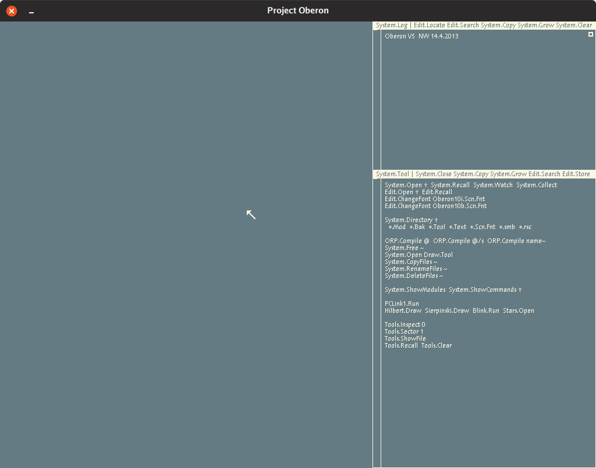
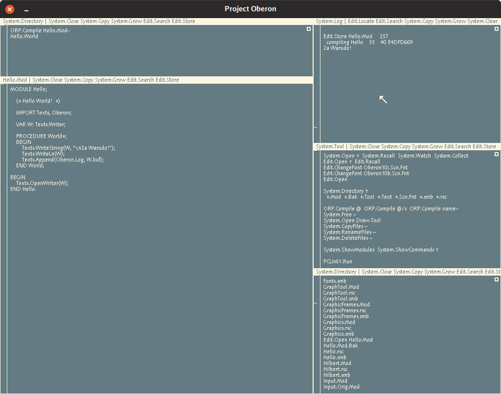
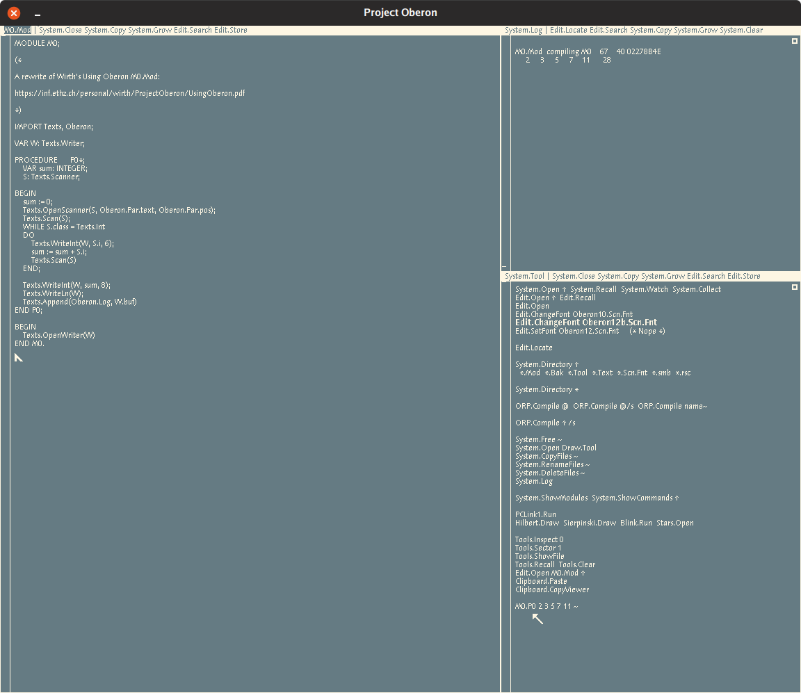

+++
title = "Playing with Oberon in 2019"
date = "2019-09-01"
tags = [
	"oberon",
]
+++

# Playing with Oberon in 2019

[Oberon](http://www.projectoberon.com/) is the name for an operating system and language pair written by [Niklaus Wirth](https://inf.ethz.ch/personal/wirth/).

Oberon is notable for being simple and powerful in a manner which permits Oberon to be pleasant for use with education. 

Refer to Wikipedia for some history and exposition: <https://en.wikipedia.org/wiki/Oberon_(operating_system)>

## Getting Oberon

The easiest way to get Oberon up and running from unix is through pdewacht's risc emu: <https://github.com/pdewacht/oberon-risc-emu>

You can also, from unix, use A2 Oberon Subsystem for Unix (aosunix). This can be acquired a few different ways, but the easiest way is probably via fld's directory: <http://www.informatik.uni-bremen.de/~fld/UnixAos/>

If you do go this route, you'll need to follow the `Readme.txt` and download a `rev.*/{install.UnixA2, *-*bit.tgz}` of your choice. 

_Disclaimer_: At the time of writing I have not gotten Oberon proper to compile/run my own programs under Bluebottle. I can write under Bluebottle's main desktop interface/programs just fine, but I want straight Oberon. 

If you want the A2 sources at their root, you can clone the main sources tree via subversion: 

```shell
svn checkout --user infsvn.anonymous https://svn-dept.inf.ethz.ch/svn/lecturers/a2/	# Password: anonymous
```

These can be browsed online via: <https://svn-dept.inf.ethz.ch/svn/lecturers/a2/?username=infsvn.anonymous?password=anonymous>

There's also a community repository served via subversion:

```shell
svn checkout https://www.ocp.inf.ethz.ch/svn/ocp/
```

You can play with Oberon in the browser via: <https://schierlm.github.io/OberonEmulator/emu-wasm.html?image=UnicodeDiskImageWithSource&width=1024&height=576>

## Using Oberon

For the purposes of this post I'll be using pdewacht's Oberon risc emu. 

Note the presence of `Clipboard.Paste` and `Clipboard.CopyViewer` in this Oberon. This will be useful later. 

### Mouse

I'll use the format of mb[1-3] to describe mouse buttons to press. A mouse with three buttons is recommended. 

- mb1 is the left mouse button, used for placing the caret
- mb2 is the middle mouse button (or hover and press the Alt key), used for running commands
- mb3 is the right mouse button, used for selecting text

### Commands

Commands are text in the form of `Module.Procedure`. 

Arguments to a command can be specified by highlighting the arguments with mb3 and running the command with mb2. For example, you can highlight `*.Mod` and run `System.Directory` as shown in the System side at start. This should list all the directory contents which end with `.Mod`. 

A useful command not shown by default is `Edit.Locate` which takes an argument of the form `pos x`. This format is emitted by the `ORP.Compile` command and the usage I enjoyed was as such:

1. Trigger an error in the form of `pos 142 undef`
2. Mb1 inside the .Mod file in question
3. Mb3 select the `pos 142` string
4. Mb2 on `Edit.Locate`
5. Jump to position occurs

All windows are referred to as Texts. All Texts are editable. All Texts have a Title Bar which is not editable. Title Bar contents can be selected with mb3 and/or executed with mb2. 

There are some special symbols found in arguments to commands:

- `~` passes the preceding whitespace-separated text as a list of arguments (see the M0.Mod example later)
- `^` passes either the single word/name to the left of it or a single word/name that's been selected with mb3
- `@` passes in the current mb3-selected text

## Writing Programs

Start the emulator!



On the right hand there's the System track and the left hand there's the Edit track. 

### Hello World

Let's compile and run hello world ☺!

Hello.Mod:

```text
MODULE Hello;

(* Hello World!  *)

IMPORT Texts, Oberon;

VAR W: Texts.Writer;

PROCEDURE World*;
BEGIN
	Texts.WriteString(W, "\nZa Warudo!");
	Texts.WriteLn(W);
	Texts.Append(Oberon.Log, W.buf);
END World;

BEGIN
	Texts.OpenWriter(W);
END Hello.
```

1. Enter a line inside any existing Text in the form:

```text
Edit.Open Hello.Mod
Clipboard.Paste
ORP.Compile Hello.Mod ^ /s
Hello.World
```

2. Mb2 over `Edit.Open`
3. From the host, copy the source for [Hello.Mod](./Hello.Mod)
4. Mb1 inside the newly opened Text for Hello.Mod
5. Mb2 over `Clipboard.Paste`
6. Mb2 over `Edit.Store` in the `Hello.Mod` Title Bar
	- You should see a line like `Edit.Store Hello.Mod     257` in the `System.Log` Text
7. Mb2 over `ORP.Compile Hello.Mod ^ /s`
	- You should see a line like `compiling Hello    33    40 E4DFD669` in the log
	- Note: the /s argument is described to allow overwriting previously generated symbols
8. Mb2 over `Hello.World`
	- You should see a hello world-like message in the log



### M0 from Wirth Space

I modified Wirth's [M0.Mod](./M0.Mod) example from [Using Oberon](https://inf.ethz.ch/personal/wirth/ProjectOberon/UsingOberon.pdf) which shows some ascpects of a typical Oberon program:

MODULE M0;

```text
(* 

A rewrite of Wirth's Using Oberon M0.Mod:

https://inf.ethz.ch/personal/wirth/ProjectOberon/UsingOberon.pdf

*)

IMPORT Texts, Oberon;

VAR W: Texts.Writer;       

PROCEDURE      P0*;      
	VAR sum: INTEGER; 
	S: Texts.Scanner; 

BEGIN
	sum := 0;             
	Texts.OpenScanner(S, Oberon.Par.text, Oberon.Par.pos); 
	Texts.Scan(S); 
	WHILE S.class = Texts.Int 
	DO    
		Texts.WriteInt(W, S.i, 6); 
		sum := sum + S.i; 
		Texts.Scan(S)             
	END;
      
	Texts.WriteInt(W, sum, 8); 
	Texts.WriteLn(W); 
	Texts.Append(Oberon.Log, W.buf)       
END P0;      

BEGIN 
	Texts.OpenWriter(W) 
END M0. 
```



## Some Stuff Oberon Inspired

### Limbo

[Limbo](https://github.com/henesy/limbobyexample) is a language written for the [Inferno](https://github.com/henesy/awesome-inferno) operating system which runs on the [Dis](http://doc.cat-v.org/inferno/4th_edition/dis_VM_specification) virtual machine. 

Some fun similarities in Limbo from Oberon's language:

- `:=` syntax for implicitly-typed variable initialization
- `name: type` for explicitly-typed variable declaration
- Modules!
- Dynamically loaded/freed modules
- Types and functions from imported (included) modules being referenced in the `Module.Name` format

You can play with Limbo/Inferno in the browser via [Pete](http://debu.gs/)'s [Try Inferno](http://tryinferno.rekka.io). 

### Go

This is mostly due to [Go](https://golang.org/)'s lineage, see most of the Limbo section above. 

The format for declaring a variable's type does show up in Go as:

	var x int

compare this to Oberon's equivalent:

	VAR sum: INTEGER;

This is a Pascal-ism, but as the language heritage of Go is descended from Pascal, it's worth mentioning. This is also true of Limbo. 

### Acme

[Acme](http://acme.cat-v.org) is an editor which expresses itself as a [9p](http://9p.cat-v.org/) filesystem originally written for [Plan9](http://doc.cat-v.org/plan_9/) in [Alef](http://doc.cat-v.org/plan_9/2nd_edition/papers/alef/ref) which drew a great deal of inspiration from Oberon. I (and others!) use Acme as the day-to-day editor of choice. I wouldn't leave home without it ☺.

Some fun differences in Acme from Oberon's Textual-User-Interface (TUI): 

- Scrollbar mouse buttons are flipped
- Tags (Title Bars) are editable
- Mb2 can select and execute with arguments
- Mb3 can select and jump to occurences similar to using Oberon's `Edit.Search`
- Mb1 sets a cursor, but each window (Text) has its own cursor and mouse position is used to determine which cursor to use for an input

Acme has a few different ports and rewrites floating around:

- Original Plan9 in Alef: <http://mirror.postnix.pw/plan9_2e/sys/src/cmd/acme/>
- Plan9 in C: <https://code.9front.org/hg/plan9front/file/tip/sys/src/cmd/acme>
- Limbo: <https://bitbucket.org/inferno-os/inferno-os/src/default/appl/acme/>
- Acme-SAC, also Limbo: <https://github.com/caerwynj/acme-sac>
- Ported to Nt in C: <https://github.com/knieriem/pf9>
- Ported to unixen in C: <https://github.com/9fans/plan9port/tree/master/src/cmd/acme>
- Rewrite of the unixen port, but [suckless](http://suckless.org)-ier: <https://github.com/karahobny/acme2k>

## Sources

- [Hello.Mod](./Hello.Mod)
- [M0.Mod](./M0.Mod)

## Resources

- <https://inf.ethz.ch/personal/wirth/ProjectOberon/UsingOberon.pdf>
- <http://www.ocp.inf.ethz.ch/wiki/>
- <https://en.wikibooks.org/wiki/Oberon/>
- <https://www.inf.ethz.ch/personal/wirth/>
- <http://www.projectoberon.com/>
- <http://www.ethoberon.ethz.ch/WirthPubl/ProgInOberon.pdf>
- <https://github.com/andreaspirklbauer/Oberon-experimental>
- <https://github.com/pdewacht/oberon-risc-emu>
- <https://github.com/schierlm/OberonEmulator>
- <https://www.youtube.com/watch?v=5niGplCza7s>
- <https://www.youtube.com/watch?v=EXY78gPMvl0>
- <https://www.youtube.com/watch?v=BJIqHIYSDrk>
